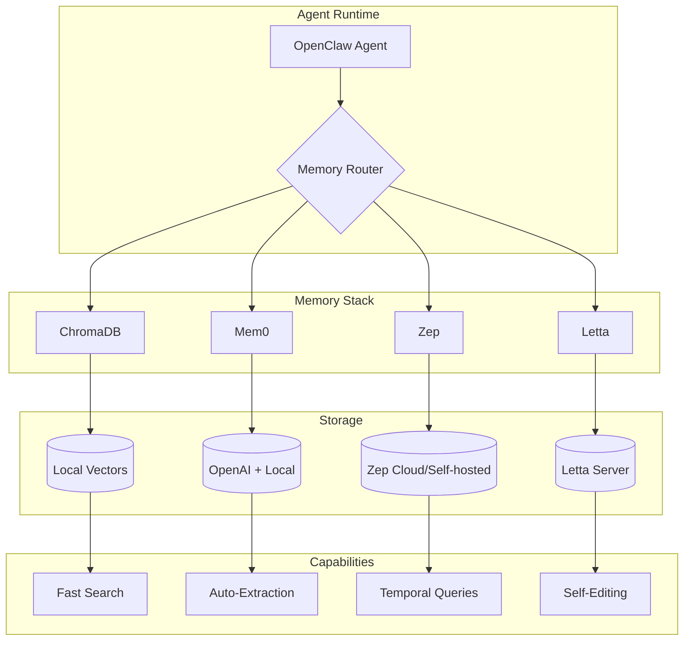

# 🦉 owl-brain

**Advanced memory stack for OpenClaw agents**

*Built at 3am by the night crew. Because the best ideas come when everyone else is sleeping.*

---

## What is this?

owl-brain is a curated memory stack that gives your OpenClaw agents **actual memory** — not just context stuffing, but real, persistent, intelligent recall.

Most AI "memory" today is just cramming more tokens into context. That doesn't scale and it doesn't feel like memory. Real memory is:
- **Selective** — not everything matters
- **Temporal** — when things happened changes their meaning  
- **Hierarchical** — some memories are core, others are trivia
- **Self-maintaining** — you don't manually index your brain

owl-brain gives you tools that actually think about memory this way.

---

## 📚 The Memory Systems

We're combining four powerful memory systems, each with distinct superpowers:

| Package | Primary Strength | Best For |
|---------|-----------------|----------|
| **Mem0** | Auto-extraction | "I remember you mentioned that last week" |
| **ChromaDB** | Local speed | Fast semantic search, zero infrastructure |
| **Zep** | Temporal awareness | "That was before you changed jobs" |
| **Letta** | Self-editing memory | Agent maintains its own memory hierarchy |

---

### 🧠 Mem0 — Agentic Memory with Auto-Extraction

**What it does:** Mem0 automatically extracts facts and memories from conversations. You feed it a conversation, it pulls out what matters and stores it.

**How it works:**
```python
from mem0 import Memory

m = Memory()

# Feed it a conversation
conversation = [
    {"role": "user", "content": "I'm working on a project called Toastique"},
    {"role": "assistant", "content": "Tell me about it!"},
    {"role": "user", "content": "It's a CMS built with Next.js and Supabase. I prefer Supabase over Firebase."}
]

# Mem0 auto-extracts memories
m.add(conversation, user_id="jack")

# Later, search for relevant memories
results = m.search("tech preferences", user_id="jack")
# Returns: "User prefers Supabase over Firebase"
```

**Memory Tiers:**
- **User-level** (`user_id`) — Persistent across all sessions for a user
- **Session-level** (`session_id`) — Scoped to a specific conversation session
- **Agent-level** (`agent_id`) — Shared knowledge across all users of an agent

**Why it's powerful:**
- No manual tagging — it figures out what's important
- Deduplication — won't store the same fact twice
- Semantic search — finds relevant memories even with different wording
- Uses OpenAI embeddings under the hood (requires API key)

**Best for:** Agents that have ongoing relationships with users and need to remember preferences, facts, and context automatically.

---

### 🔷 ChromaDB — Local Vector Store

**What it does:** ChromaDB is a vector database that runs entirely locally. No server, no API keys (for the DB itself), no cloud dependency. It just works.

**How it works:**
```python
import chromadb

# Persistent storage (survives restarts)
client = chromadb.PersistentClient(path="./chroma_db")

# Create a collection
collection = client.get_or_create_collection(
    name="agent_memories",
    metadata={"hnsw:space": "cosine"}  # Cosine similarity
)

# Add memories
collection.add(
    documents=["Jack prefers dark mode", "Project deadline is Friday"],
    metadatas=[{"type": "preference"}, {"type": "task"}],
    ids=["mem_1", "mem_2"]
)

# Semantic search
results = collection.query(
    query_texts=["user interface preferences"],
    n_results=3
)
# Returns "Jack prefers dark mode" (semantically similar)
```

**Key Features:**
- **In-process** — No separate server to run
- **Persistent** — Data survives restarts when using PersistentClient
- **Fast** — HNSW indexing for quick similarity search
- **Metadata filtering** — Query by semantic similarity + filter by metadata
- **Built-in embeddings** — Uses sentence-transformers by default (or bring your own)

**Why it's powerful:**
- Zero infrastructure — `pip install chromadb` and you're done
- Great for development and production
- Supports millions of vectors on a single machine
- Perfect foundation for other memory systems to build on

**Best for:** The foundation layer. Use ChromaDB when you need fast local vector search without any external dependencies.

---

### ⏱️ Zep — Temporal-Aware Memory

**What it does:** Zep understands *when* things happened. It can answer questions like "What did they say about X before the project pivot?" or "What changed after our last meeting?"

**How it works:**
```python
from zep_python import ZepClient
from zep_python.memory import Memory, Message

# Connect to Zep (Cloud or self-hosted)
client = ZepClient(api_key="${ZEP_API_KEY}")  # Or base_url for self-hosted

# Create a session for the user
await client.memory.add_session(
    session_id="project-alpha-session",
    user_id="jack"
)

# Add messages (Zep tracks timestamps automatically)
messages = [
    Message(role="user", content="Let's use PostgreSQL for the database"),
    Message(role="assistant", content="Good choice!"),
    # ... one week later ...
    Message(role="user", content="Actually, let's switch to Supabase"),
]
await client.memory.add("project-alpha-session", Memory(messages=messages))

# Temporal search
results = await client.memory.search(
    "project-alpha-session",
    "what database was originally planned",  # Understands "originally"
    limit=5
)
```

**Key Features:**
- **Session management** — Group conversations into logical sessions
- **Automatic summarization** — Compresses long conversations
- **Temporal queries** — "before", "after", "recently", "originally"
- **User facts extraction** — Builds a profile of the user over time
- **Entity extraction** — Identifies people, places, projects mentioned

**Deployment Options:**
- **Zep Cloud** — Managed service, API key auth
- **Self-hosted** — Docker compose, full control

**Why it's powerful:**
Time changes meaning. "The deadline is Friday" means something different if it was said yesterday vs. three weeks ago. Zep tracks this automatically.

**Best for:** Long-running agent relationships where temporal context matters. Project management, ongoing client relationships, evolving situations.

---

### 📚 Letta — Self-Editing Hierarchical Memory

**What it does:** Letta (formerly MemGPT) gives agents control over their own memory. The agent decides what to remember, where to store it, and when to forget.

**How it works:**
```python
from letta import create_client

# Connect to Letta server (run: letta server)
client = create_client(base_url="http://localhost:8283")

# Create an agent with self-editing memory
agent = client.create_agent(
    name="owl-agent",
    memory={
        "persona": "I'm an AI assistant with persistent memory.",
        "human": "The user I'm helping."
    }
)

# Chat with the agent
response = client.send_message(
    agent_id=agent.id,
    message="Remember that I prefer dark mode and hate morning meetings",
    role="user"
)
# The agent itself decides to store this in core_memory
```

**Memory Hierarchy:**

```
┌─────────────────────────────────────────┐
│           CORE MEMORY                   │
│  Always in context. Persona, key facts. │
│  "I prefer dark mode" lives here.       │
├─────────────────────────────────────────┤
│          RECALL MEMORY                  │
│  Recent conversation history.           │
│  Searchable, auto-managed.              │
├─────────────────────────────────────────┤
│         ARCHIVAL MEMORY                 │
│  Long-term storage. Unlimited size.     │
│  Agent searches when needed.            │
└─────────────────────────────────────────┘
```

**Key Features:**
- **Self-editing** — Agent calls functions to manage its own memory
- **Hierarchical** — Core (always active), Recall (recent), Archival (long-term)
- **Web UI** — Visual interface at `http://localhost:8283`
- **Conversation persistence** — Pick up where you left off
- **Tool use** — Agents can use tools while managing memory

**Why it's powerful:**
Instead of you deciding what to remember, the agent does. It learns what's important and organizes its own mind. This is closer to how human memory actually works.

**Best for:** Sophisticated agents that need to manage complex, long-term relationships. When you want the agent to be truly autonomous about its memory.

---

## 🏗️ Architecture

### How the systems work together:



### Recommended Architecture Patterns:

**Minimal (Zero Infrastructure)**
```
┌─────────────┐
│   Agent     │
└──────┬──────┘
       │
       ▼
┌─────────────┐
│  ChromaDB   │ ← Just pip install, nothing else
└──────┬──────┘
       │
       ▼
   ./chroma_db/
```

**Standard (Best Balance)**
```
┌─────────────┐
│   Agent     │
└──────┬──────┘
       │
   ┌───┴───┐
   ▼       ▼
┌──────┐ ┌──────┐
│Chroma│ │ Mem0 │ ← ChromaDB for speed, Mem0 for auto-extraction
└──┬───┘ └──┬───┘
   │        │
   ▼        ▼
Local    OpenAI API
```

**Full Stack (Maximum Capability)**
```
┌─────────────────────────────────────────┐
│              Agent                       │
└─────────────────┬───────────────────────┘
                  │
    ┌─────────────┼─────────────┐
    │             │             │
    ▼             ▼             ▼
┌───────┐    ┌────────┐    ┌────────┐
│Chroma │    │  Mem0  │    │  Zep   │
│+ Mem0 │    │        │    │        │
└───┬───┘    └───┬────┘    └───┬────┘
    │            │             │
    └────────────┴─────────────┘
                 │
                 ▼
         ┌─────────────┐
         │   Letta     │ ← Top layer: self-editing memory
         │  (Server)   │
         └─────────────┘
```

---

## 🎯 Use Cases — When to Use What

### Decision Tree

```
Need memory for your agent?
│
├─► Just want fast semantic search, no setup?
│   └─► ChromaDB ✓
│
├─► Want automatic memory extraction from conversations?
│   └─► Mem0 (+ ChromaDB for speed) ✓
│
├─► Need to answer "when did X happen?" questions?
│   └─► Zep (temporal awareness) ✓
│
├─► Want the agent to manage its own memory?
│   └─► Letta (self-editing hierarchy) ✓
│
└─► Want it all?
    └─► Layer them: ChromaDB → Mem0 → Zep → Letta ✓
```

### Concrete Examples

| Scenario | Recommended Stack | Why |
|----------|------------------|-----|
| Personal assistant remembering preferences | Mem0 + ChromaDB | Auto-extracts "I prefer X" statements |
| Code assistant tracking project context | ChromaDB | Fast local search, no API costs |
| Project manager tracking timelines | Zep | "What was decided before the pivot?" |
| Long-term companion/tutor | Letta | Needs to manage complex relationship |
| Multi-user SaaS with memory | Mem0 (Cloud) | User/session/agent tiers built-in |
| Privacy-critical application | ChromaDB only | Fully local, no data leaves machine |
| Research agent with massive context | Letta + ChromaDB | Hierarchical + fast archival search |

---

## 📊 Feature Comparison

| Feature | ChromaDB | Mem0 | Zep | Letta |
|---------|----------|------|-----|-------|
| **Setup** | `pip install` | `pip install` + OpenAI key | Server or Cloud | Server required |
| **Infrastructure** | None | None | Docker or Cloud | Local server |
| **Semantic Search** | ✅ Fast | ✅ Good | ✅ Good | ✅ Good |
| **Auto-Extraction** | ❌ Manual | ✅ Automatic | ✅ Summaries | ✅ Agent-controlled |
| **Temporal Queries** | ❌ | ❌ | ✅ Core feature | ⚠️ Limited |
| **User/Session Tiers** | ⚠️ Manual | ✅ Built-in | ✅ Built-in | ✅ Built-in |
| **Self-Editing Memory** | ❌ | ❌ | ❌ | ✅ Core feature |
| **Web UI** | ❌ | ❌ | ✅ Cloud dashboard | ✅ localhost:8283 |
| **Offline Support** | ✅ Full | ⚠️ Needs OpenAI | ⚠️ Self-hosted only | ✅ Full |
| **Cost** | Free | OpenAI API costs | Free tier / Paid | Free (local) |
| **Scalability** | Millions of vectors | Depends on backend | Enterprise-ready | Single agent focus |

### Performance Characteristics

| System | Latency (typical) | Storage | Memory Usage |
|--------|------------------|---------|--------------|
| ChromaDB | 1-10ms | ~1KB per vector | ~100MB base |
| Mem0 | 100-500ms (API call) | Cloud-dependent | Minimal |
| Zep | 50-200ms | Cloud/Docker | 512MB+ (server) |
| Letta | 200-1000ms | Local SQLite | 1GB+ (server) |

---

## 🔌 OpenClaw Integration

### Adding to Your Agent

1. **Add the TOOLS.md snippet** to your agent's workspace:

```markdown
## Advanced Memory Stack (.venv-memory)

Virtual environment: `~/clawd/.venv-memory` (Python 3.12)
Activate: `source ~/clawd/.venv-memory/bin/activate`

**Installed Packages:**
- ✅ **Mem0** (`from mem0 import Memory`) — Agentic memory with auto-extraction
- ✅ **ChromaDB** (`import chromadb`) — Local vector database  
- ✅ **Zep** (`import zep_python`) — Temporal-aware memory
- ✅ **Letta** (`from letta import client`) — Self-editing hierarchical memory

**When to use what:**
- **Quick semantic search**: ChromaDB
- **Auto-extract from conversations**: Mem0
- **Time-aware queries**: Zep
- **Agent-managed memory**: Letta
```

2. **Use the unified interface:**

```python
from openclaw_memory import OpenClawMemory

# Initialize
memory = OpenClawMemory(persist_path="./agent_memory")
memory.set_user("jack")

# Store memories
memory.remember("User prefers dark mode", metadata={"type": "preference"})

# Process conversations automatically
memory.remember_conversation(messages)

# Recall relevant context
results = memory.recall("what are the user's UI preferences")

# Get formatted context for prompts
context = memory.get_context()
```

3. **Configure your environment:**

```bash
# Required for Mem0
export OPENAI_API_KEY="${OPENAI_API_KEY}"

# Optional: Zep Cloud
export ZEP_API_KEY="${ZEP_API_KEY}"

# Optional: Self-hosted Zep
export ZEP_API_URL="http://localhost:8000"
```

### Integration Patterns

**Pattern 1: Memory-Augmented Responses**
```python
# Before generating a response, pull relevant memories
memories = memory.recall(user_message, n_results=5)
context = "\n".join([m.content for m in memories])

# Include in system prompt
system_prompt = f"""You are a helpful assistant.

Relevant memories about this user:
{context}

Use these memories to personalize your response."""
```

**Pattern 2: Post-Conversation Memory Update**
```python
# After a conversation, store it
memory.remember_conversation(conversation_messages)

# Mem0 auto-extracts: "User mentioned preferring Python over JavaScript"
```

**Pattern 3: Temporal Context**
```python
# Using Zep for time-aware recall
recent = await zep.search(session_id, "recent decisions")
historical = await zep.search(session_id, "original plan")

# Compare what changed over time
```

---

## 🚀 Quick Start

```bash
# Clone it
git clone https://github.com/Jacknelson6/owl-brain.git
cd owl-brain

# Create your venv (Python 3.12+)
python3.12 -m venv .venv
source .venv/bin/activate

# Install the stack
pip install mem0ai chromadb httpx

# Run a search
python unified/atlas_recall.py "What do I know about the user?"

# Index your memory files
python unified/atlas_recall.py --index
```

See [SETUP.md](SETUP.md) for the full guide with troubleshooting.

## 🎯 Unified Recall System (NEW)

The `unified/` folder contains the **production-ready** recall system that combines all backends:

```bash
# Search across all memory systems at once
python unified/atlas_recall.py "What are the user's preferences?"

# Index your markdown memory files
python unified/atlas_recall.py --index

# Add facts manually (Mem0 auto-extracts key info)
python unified/atlas_recall.py --add "User prefers dark mode and hates meetings"

# Check what's stored
python unified/atlas_recall.py --stats
```

**What happens on search:**
1. **Mem0** searches auto-extracted facts
2. **ChromaDB** searches chunked documents (your .md files)
3. **Letta** searches archival memory (if running)
4. Results are combined, ranked, and deduplicated

See [unified/README.md](unified/README.md) for full documentation.

## Why These Four?

We tested a lot of memory solutions. These survived the 3am gauntlet:

| System | Superpower |
|--------|-----------|
| **Mem0** | Auto-extracts facts from prose — no manual tagging |
| **ChromaDB** | Zero infrastructure, runs in-process, fast |
| **Zep** | Temporal queries — "what did they say before X?" |
| **Letta** | Self-editing hierarchical memory — agent maintains its own brain |

Use one, use all, mix and match. Your agent, your rules.

---

## 📁 Repository Structure

```
owl-brain/
├── README.md               # You're here
├── SETUP.md                # Detailed installation guide
├── requirements.txt        # Python dependencies
├── unified/                # 🎯 PRODUCTION SYSTEM
│   ├── atlas_recall.py     # Full CLI for search, index, stats
│   ├── recall              # Shell wrapper
│   └── README.md           # Usage documentation
├── docs/
│   └── TOOLS-snippet.md    # Copy-paste for your agent's TOOLS.md
├── examples/
│   ├── mem0-basic.py           # Mem0 standalone example
│   ├── chromadb-basic.py       # ChromaDB standalone example
│   ├── zep-basic.py            # Zep standalone example
│   ├── letta-basic.py          # Letta standalone example
│   └── openclaw-integration.py # Unified interface example
└── test/
    └── memory-stack-test.py    # Verify your installation
```

---

## 🤝 Contributing

PRs welcome! Especially:
- New integration patterns
- Performance benchmarks
- Additional memory system integrations
- Documentation improvements

If you're also up at 3am, you're our kind of people.

---

## 📜 License

MIT — use it, fork it, make it better.

---

## 🔗 Links

- **Mem0**: [docs.mem0.ai](https://docs.mem0.ai/)
- **ChromaDB**: [docs.trychroma.com](https://docs.trychroma.com/)
- **Zep**: [docs.getzep.com](https://docs.getzep.com/)
- **Letta**: [docs.letta.com](https://docs.letta.com/)
- **OpenClaw**: [openclaw.org](https://openclaw.org/)

---

*"The owl sees what others miss in the dark."*

🦉 Night Crew
